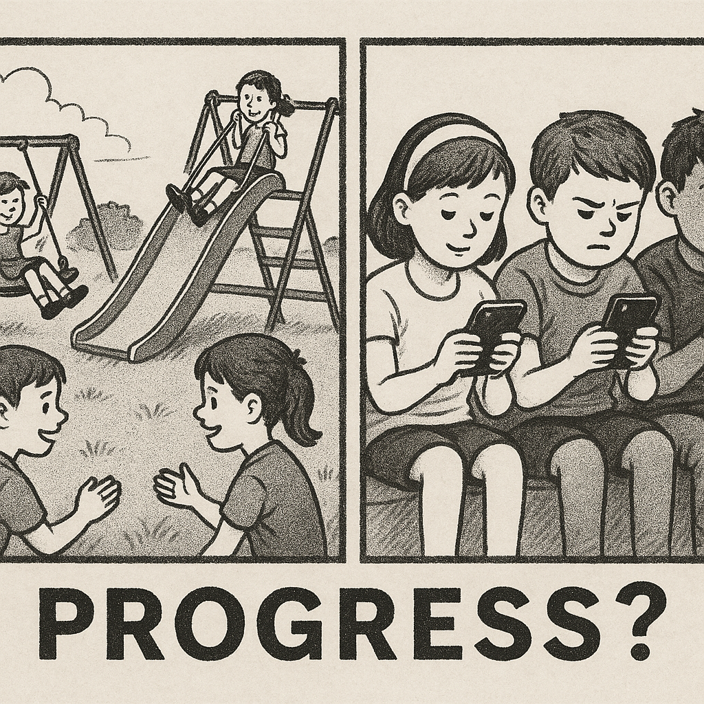

In this essay, I aim to analyze the blind spots of modernity. By modernity, I do not simply mean what is “new” or “contemporary.” Rather, modernity is a way of looking at the world—one that took shape in Europe during the Enlightenment. It replaced the authority of kings and churches with the authority of reason, science, and individual rights. Over time, this outlook reshaped politics, law, and international relations. The results were real: compared to the blood-soaked centuries of religious wars and dynastic rivalries, the modern age—especially after the catastrophe of World War II—saw a remarkable decline in large-scale violence. Many historians and political scientists have even described this as a long “arc of history” bending toward peace.

Yet today, that trend feels as if it is stalling—or even reversing. Despite modernity’s promises and progress in many spheres of life, we live in a world where violence and instability remain disturbingly common, from political assassinations and man-made famines to the slow-burning crisis of climate change. How do we explain this? Has modernity itself brought us here, or do older patterns of thought and behavior still haunt us? Perhaps both are true: modernity, in its quest for rational objectivity, carries blind spots of its own, even as pre-modern legacies continue to shape our present. And when modernity is rejected, that rejection may reveal not a flaw in the people it seeks to liberate, but a deeper failure within modernity itself.

{.img-float-left width="35%"}

This backsliding feels counterintuitive. If modernity has helped produce a more peaceful and prosperous world, why is its rejection so widespread? If rational inquiry has proven itself superior to superstition, why do so many still turn to conspiracies and magical thinking? The consequences are real. Diseases once under control, such as measles, are resurging: the U.S. recorded more than 1,300 cases in 2025, the highest since the early 1990s [1](https://people.com/measles-cases-at-record-high-since-being-eliminated-in-2000-11768617), while Europe saw cases more than double between 2023 and 2024 [2](https://www.ft.com/content/bfbc8afc-111d-4975-9381-0fc69ccd7b0f). Meanwhile, despite a scientific consensus exceeding 97% [3](https://en.wikipedia.org/wiki/Scientific_consensus_on_climate_change), about one in four Americans continues to dismiss human-caused climate change as a hoax [4](https://misinforeview.hks.harvard.edu/articleunderstanding-climate-change-conspiracy-beliefs-a-comparative-outlook). Such persistence is fueled not only by misinformation but also by a deeper strain of anti-intellectualism—a cultural suspicion of experts, scholars, and evidence itself.

One common explanation holds that this resistance stems from our evolutionary wiring: that primitive parts of the brain—like the amygdala—process threats and beliefs through fast, emotional heuristics that often bypass rational thought, making it hard to absorb abstract scientific concepts [5](https://en.wikipedia.org/wiki/Thinking,_Fast_and_Slow). This is supported by “mismatch theory,” which suggests our Stone Age cognitive architecture is poorly adapted to the demands of complex, modern life [6](https://en.wikipedia.org/wiki/Evolutionary_mismatch). Yet this explains only part of the story. 

To gain a fuller picture, let’s consider India at the turn of the 20th century. The British had installed railroads and telegraph lines—modern marvels of engineering—emblems of industrial progress. Yet many indigenous Indians initially met these innovations with suspicion. Some feared they were a form of sorcery. Others, more accurately, feared them as instruments of colonial control, and not without reason: the new infrastructure was used primarily to transport soldiers and gather intelligence in the event of uprisings.

This early ambivalence toward modern technology—caught between awe and mistrust—finds clear parallels in our own time. Consider the introduction of 5G networks and the anxieties surrounding microwave radiation, or the backlash against genetically modified foods and vaccinations. These fears are irrational, but the unease they express is not. Beneath the pseudoscience lies something deeper: a loss of faith in the institutions that claim to serve the public good. Many people instinctively prefer what seems “natural” over what is synthetic, and they often view the institutions advancing such technologies as opaque, profit-driven, or even exploitative—and not without reason.

Just as many in colonial India distrusted railroads and telegraphs because they correctly perceived them as tools of domination, people today may resist modern institutions not out of ignorance, but because they recognize—at least intuitively—that those systems often serve narrow interests rather than the common good. It is rarely that technologies like vaccines are themselves part of a nefarious agenda; rather, mistrust grows when the institutions promoting them engage in practices—such as predatory pricing or opaque decision-making—that signal self-interest over public welfare.

The core of the problem lies deeper still—in modernity’s own assumptions about what it means to be human. These assumptions shape not just our technologies, but our values and institutions. They raise questions we seldom pause to ask: 

* What do we mean by progress? 
* What is, at its core, freedom? 
* What are our true needs as humans? 

These assumptions are embedded in our policies, cultures, and systems. And those systems, in turn, often prioritize profit, efficiency, and short-term gain above all else. In doing so, they create structures that feel exploitative and alienating—prompting people, consciously or not, to reject them. When we design our institutions around the belief that people are driven solely by self-interest, should we be surprised when they foster narcissism, alienation, and leaders who embody those same values?

{.img-float-right style="width:35%"}

At its core, modernity gave us freedom, but not connection or guidance. It dismantled the hierarchies of the past, but in doing so it also weakened our sense of belonging—and it did so without ever answering how this loss might be repaired. 

These ideas—the connection between modernity, technology, exploitation, and dominance—will be explored throughout this essay. This is not a rejection of modernity. Modernity has brought immense progress. But without self-reflection and reform, we risk losing the very gains it has delivered.

In the next chapter, we turn to the question of **freedom**—modernity’s most cherished ideal. Modernity understands itself as a project for the liberation of humankind, yet to grasp its deepest shortcomings, we must first examine what liberty truly means.  